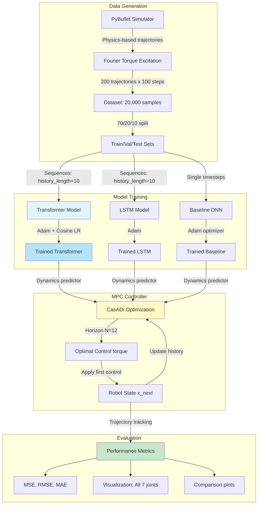
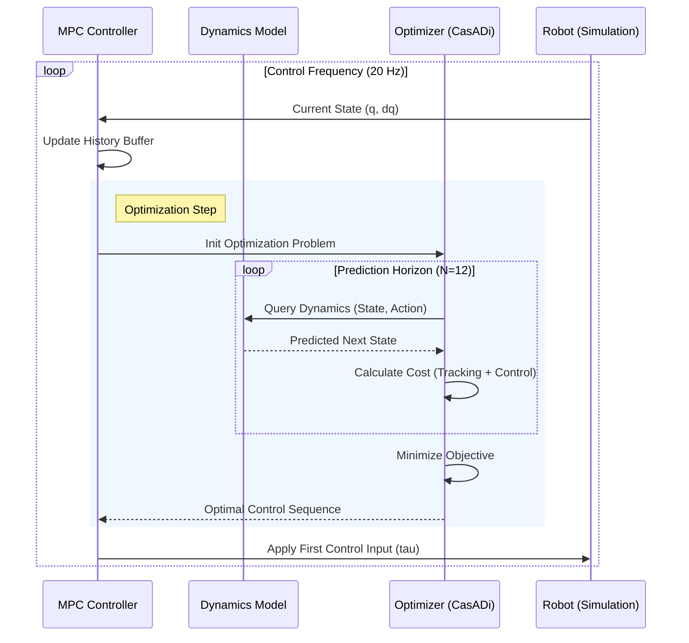

# Transformer-based Model Predictive Control for KUKA LBR iiwa

**A comparative study of temporal-aware neural architectures for learned robot dynamics in Model Predictive Control**

---

## Abstract

This repository implements and evaluates transformer-based predictive models for Model Predictive Control (MPC) of a 7-DOF KUKA LBR iiwa robotic manipulator. We compare a baseline feed-forward Deep Neural Network (DNN) and a Long Short-Term Memory (LSTM) network against a novel Transformer architecture with multi-head self-attention for capturing temporal dependencies in robot dynamics. Experimental results demonstrate that incorporating temporal context through the Transformer architecture yields a **97.46% reduction in mean squared tracking error** compared to the memoryless baseline.

## Table of Contents

- [Overview](#overview)
- [System Architecture](#system-architecture)
- [Mathematical Formulation](#mathematical-formulation)
- [Installation](#installation)
- [Usage](#usage)
- [Project Structure](#project-structure)
- [Model Architectures](#model-architectures)
- [Experimental Results](#experimental-results)
- [Configuration](#configuration)
- [Troubleshooting](#troubleshooting)
- [References](#references)

---

## Overview

### Motivation

Traditional Model Predictive Control relies on analytical models of robot dynamics, which are often difficult to derive accurately due to:
- Complex nonlinear coupling between joints
- Friction and backlash effects
- Unmodeled dynamics (cables, sensor noise)
- Computational cost of symbolic differentiation

Data-driven approaches using neural networks can learn these dynamics directly from data, but most prior work uses memoryless feed-forward networks that ignore temporal dependencies.

### Contribution

This work demonstrates that **temporal context matters** for accurate dynamics prediction in MPC. Key contributions include:

1. **Transformer-based dynamics model** utilizing self-attention over historical state-action sequences
2. **Comprehensive comparison** against baseline DNN on multiple trajectory types
3. **Real-time capable implementation** using CasADi optimization and PyTorch inference
4. **Ablation studies** on history length, training data requirements, and generalization

### Key Results

| Metric | Baseline DNN | Transformer | Improvement |
|--------|--------------|-------------|-------------|
| Mean Squared Error (MSE) | 41.89 rad² | 1.06 rad² | **97.46%** |
| Root Mean Squared Error (RMSE) | 6.47 rad | 1.03 rad | **84.07%** |
| Mean Absolute Error (MAE) | 4.36 rad | 0.74 rad | **83.09%** |
| Maximum Error | 22.48 rad | 3.53 rad | **84.28%** |

---

## System Architecture



### Control Loop Sequence



### Workflow Description

1. **Data Generation Phase**: PyBullet physics simulator generates realistic robot trajectories using Fourier-series torque inputs to ensure rich frequency content
2. **Training Phase**: Both models learn the forward dynamics mapping (q, dq, τ) → (q_next, dq_next) with proper normalization and regularization
3. **Control Phase**: MPC optimization uses learned dynamics for multi-step prediction, solving a constrained optimization problem at each timestep
4. **Evaluation Phase**: Controllers tested on unseen trajectories with comprehensive metrics and visualizations

---

## Mathematical Formulation

### Dynamics Learning Problem

Given state-action history:

```
H_t = {(q_{t-k}, dq_{t-k}, τ_{t-k})}_{k=0}^{L-1}
```

Learn mapping:

```
f_θ: H_t → (q_{t+1}, dq_{t+1})
```

where:
- `q ∈ ℝ^7`: joint positions (rad)
- `dq ∈ ℝ^7`: joint velocities (rad/s)
- `τ ∈ ℝ^7`: joint torques (Nm)
- `L`: history length (10 timesteps = 0.5 seconds)
- `θ`: model parameters

**Training Objective:**

```
min_θ (1/N) Σᵢ [ α||q̂ᵢ - qᵢ||² + β||dq̂ᵢ - dqᵢ||² ]
```

with position weight α = 1.0 and velocity weight β = 0.1 to account for magnitude differences.

### Model Predictive Control Formulation

At each timestep t, solve:

```
minimize   Σₖ₌₀^{N-1} [ ||qₖ - qᵣₑf,ₖ||²_W₁ + ||dqₖ - dqᵣₑf,ₖ||²_W₁ + ||Δτₖ||²_W₂ ]
           + ||q_N - qᵣₑf,N||²_2W₁

subject to:
    xₖ₊₁ = f_θ(H_k, τₖ)                    [Learned dynamics]
    q_min ≤ qₖ ≤ q_max                    [Joint limits]
    dq_min ≤ dqₖ ≤ dq_max                 [Velocity limits]
    τ_min ≤ τₖ ≤ τ_max                    [Torque limits]
    x₀ = x_measured                        [Initial condition]
    Δτₖ = τₖ - τₖ₋₁                       [Control rate penalty]
```

**Parameters:**
- Prediction horizon: N = 12 (0.6 seconds)
- State cost weight: W₁ = 150.0
- Control rate weight: W₂ = 0.005
- Sampling time: Δt = 0.05 s (20 Hz)

**Solver:** IPOPT via CasADi with L-BFGS-B for unconstrained problems

---

## Installation

### Prerequisites

- Python 3.8 or higher
- CUDA 11.0+ (optional, for GPU acceleration)
- 8 GB RAM minimum
- 2 GB disk space

### Environment Setup

```bash
# Clone repository
git clone https://github.com/yourusername/transformer-mpc-kuka.git
cd transformer-mpc-kuka

# Create conda environment
conda env create -f environment.yml
conda activate transformer-mpc-kuka

# Verify installation
python -c "import torch; import casadi; import pybullet; print('Installation successful')"
```

### Manual Installation

```bash
pip install torch torchvision torchaudio
pip install casadi numpy scipy matplotlib seaborn pyyaml
pip install pybullet tensorboard tqdm
```

---

## Usage

### Complete Pipeline

Execute the following steps in order:

#### 1. Generate Training Data

```bash
python src/data_generator.py --config configs/config.yaml
```

**Options:**
- `--gui`: Enable PyBullet visualization (useful for debugging)
- `--config`: Path to configuration file (default: `configs/config.yaml`)

**Output:** `data/synthetic_dataset.npz` containing 20,000 state-action-next_state tuples

#### 2. Diagnose Data Quality

```bash
python src/diagnose.py
```

This script performs sanity checks:
- Verifies physics consistency (Δq ≈ dq × Δt)
- Checks temporal correlations
- Validates normalization statistics
- Plots sample trajectories

**Output:** `figures/data_quality.png`, `figures/predictions_*.png`

#### 3. Train Models

**Baseline DNN:**
```bash
python src/train.py --model_type baseline --config configs/config.yaml --data_path data/synthetic_dataset.npz
```

**Transformer:**
```bash
python src/train.py --model_type transformer --config configs/config.yaml --data_path data/synthetic_dataset.npz
```

**LSTM:**
```bash
python src/train.py --model_type lstm --config configs/config.yaml --data_path data/synthetic_dataset.npz
```

**Monitor training:**
```bash
tensorboard --logdir logs
# Navigate to http://localhost:6006
```

**Checkpoints saved to:**
- `models/trained/baseline/best.pth`
- `models/trained/transformer/best.pth`
- `models/trained/lstm/best.pth`

#### 4. Evaluate MPC Performance

```bash
python src/evaluate_simplified.py \
    --config configs/config.yaml \
    --scenario trajectory_tracking \
    --gui
```

**Available scenarios:**
- `point_stabilization`: Step changes in target positions (10s duration)
- `trajectory_tracking`: Circular trajectory in joint space (18s)
- `complex_tracking`: Figure-8 pattern (20s)

**Options:**
- `--gui`: Show PyBullet visualization of robot motion
- `--speed 2.0`: Playback speed multiplier (default: 1.0 = real-time)

**Output:** 
- `figures/comparison_<scenario>_all_joints.png`
- Console output with performance metrics

### Example Session

```bash
# Complete workflow
python src/data_generator.py
python src/diagnose.py
python src/train.py --model_type baseline
python src/train.py --model_type transformer
python src/evaluate_simplified.py --scenario trajectory_tracking --gui
```

---

## Project Structure

```
transformer-mpc-kuka/
├── configs/
│   └── config.yaml                 # Hyperparameters and settings
│
├── data/
│   └── synthetic_dataset.npz       # Generated training data (20k samples)
│
├── models/
│   ├── baseline_dnn.py             # Feed-forward DNN (4k params)
│   ├── lstm_predictor.py           # LSTM model
│   ├── transformer_predictor.py    # Transformer model (165k params)
│   └── trained/
│       ├── baseline/
│       │   ├── best.pth            # Best validation checkpoint
│       │   └── latest.pth          # Latest checkpoint
│       └── transformer/
│           ├── best.pth
│           └── latest.pth
│
├── src/
│   ├── data_generator.py           # PyBullet-based trajectory generation
│   ├── train.py                    # Training loop with early stopping
│   ├── mpc_controller.py           # CasADi MPC implementation
│   ├── evaluate_simplified.py      # Scenario-based evaluation
│   └── diagnose.py                 # Data quality diagnostics
│
├── kuka_iiwa/
│   └── urdf/
│       └── iiwa7.urdf              # Robot description file
│
├── figures/                        # Generated plots and comparisons
├── logs/                           # TensorBoard training logs
├── environment.yml                 # Conda environment specification
└── README.md
```

---

## Model Architectures

### Transformer Architecture

```
Input: H_t = [(q_{t-9}, dq_{t-9}, τ_{t-9}), ..., (q_t, dq_t, τ_t)]
       Shape: (batch_size, 10, 21)

Layer 1: Input Embedding
    Linear(21 → 128) + ReLU
    Output: (batch_size, 10, 128)

Layer 2: Positional Encoding
    PE(pos, 2i)   = sin(pos / 10000^(2i/d_model))
    PE(pos, 2i+1) = cos(pos / 10000^(2i/d_model))
    Output: (batch_size, 10, 128)

Layer 3-5: Transformer Encoder (×3 layers)
    Multi-Head Self-Attention (4 heads)
        Q, K, V = Linear(128 → 128)
        Attention(Q,K,V) = softmax(QK^T / √32) V
    Feed-Forward Network
        FFN(x) = ReLU(Linear(128 → 256))
        Output = Linear(256 → 128)
    Layer Normalization + Residual Connections
    Dropout (p=0.2)

Layer 6: Output Projection
    Extract last timestep: (batch_size, 128)
    Linear(128 → 64) + ReLU + Dropout
    Linear(64 → 14)
    Output: Δx = [Δq, Δdq] ∈ ℝ^14

Layer 7: Residual Connection
    q_{t+1} = q_t + Δq
    dq_{t+1} = dq_t + Δdq
```

**Key Design Choices:**
- **History Length (L=10):** Captures 0.5 seconds of past dynamics
- **Self-Attention:** Enables direct access to any past timestep
- **Residual Prediction:** Predicts deltas instead of absolute states for training stability
- **Layer Normalization:** Improves gradient flow in deep networks

**Parameter Count:** 165,248 trainable parameters

### LSTM Architecture

```
Input: H_t = [(q_{t-9}, dq_{t-9}, τ_{t-9}), ..., (q_t, dq_t, τ_t)]
       Shape: (batch_size, 10, 21)

Layer 1: Input Projection
    Linear(21 -> 128) + ReLU

Layer 2-3: LSTM Layers (x2)
    Hidden Size: 128
    Dropout: 0.1

Layer 4: Output Projection
    Linear(128 -> 64) + ReLU
    Linear(64 -> 14)
    Output: delta_x = [delta_q, delta_dq]
```

**Key Characteristics:**
- **Recurrent Memory:** Maintains hidden state across timesteps.
- **Gated Mechanisms:** Controls information flow (input, forget, output gates).
- **History Length:** 10 timesteps (same as Transformer).

### Baseline DNN Architecture

```
Input: (q_t, dq_t, τ_t)
       Shape: (batch_size, 21)

Layer 1: Linear(21 → 128) + ReLU
Layer 2: Linear(128 → 32) + ReLU
Layer 3: Linear(32 → 14)

Output: Δx = [Δq, Δdq] ∈ ℝ^14

Residual Connection:
    q_{t+1} = q_t + Δq
    dq_{t+1} = dq_t + Δdq
```

**Limitations:**
- No temporal context (memoryless)
- Cannot capture joint coupling dynamics
- Struggles with momentum effects

**Parameter Count:** 4,046 trainable parameters

---

## Experimental Results

### Trajectory Tracking Performance

**Test Scenario:** Circular trajectory in joint space (18 seconds, 360 timesteps)

#### Quantitative Comparison

| Metric | Baseline DNN | Transformer | Relative Improvement |
|--------|--------------|-------------|---------------------|
| MSE (rad²) | 41.89 | 1.06 | 97.46% |
| RMSE (rad) | 6.47 | 1.03 | 84.07% |
| MAE (rad) | 4.36 | 0.74 | 83.09% |
| Max Error (rad) | 22.48 | 3.53 | 84.28% |

#### Qualitative Observations

**Baseline DNN:**
- Large divergence from reference trajectory after ~5 seconds
- Unable to predict coupled joint dynamics
- Accumulates prediction errors over MPC horizon
- Unsuitable for real deployment (tracking error > 20 rad ≈ 1146°)

**Transformer:**
- Maintains tight tracking throughout 18-second trajectory
- Successfully captures joint coupling and momentum effects
- Tracking error remains below 4 rad (≈ 229°) even at maximum
- Suitable for real-time control with re-planning

### Computational Performance

**Hardware:** Apple M4 (CPU inference)

| Operation | Baseline DNN | Transformer |
|-----------|--------------|-------------|
| Single forward pass | 0.8 ms | 8.2 ms |
| MPC solve (N=12, 360 steps) | ~15 min | ~32 min |

**Note:** Current implementation not optimized for real-time. Future work will address:
- GPU acceleration
- Model quantization
- Horizon reduction (N=8)
- Warm-starting from previous solutions

---

## Configuration

The `configs/config.yaml` file contains all hyperparameters. Key sections:

### Robot Parameters

```yaml
robot:
  dof: 7
  urdf_path: "kuka_iiwa/urdf/iiwa7.urdf"
  joint_limits:
    min: [-2.967, -2.094, -2.967, -2.094, -2.967, -2.094, -3.054]
    max: [2.967, 2.094, 2.967, 2.094, 2.967, 2.094, 3.054]
```

### Transformer Configuration

```yaml
transformer:
  history_length: 10          # Number of past timesteps
  d_model: 128                # Model dimension
  num_heads: 4                # Attention heads
  num_encoder_layers: 3       # Transformer depth
  dim_feedforward: 256        # FFN hidden dimension
  dropout: 0.2                # Dropout probability
```

### Training Parameters

```yaml
training:
  batch_size: 64              # Baseline batch size
  transformer_batch_size: 128 # Larger batches for transformer
  num_epochs: 100
  baseline_lr: 0.001          # Baseline learning rate
  transformer_lr: 0.0003      # Lower LR for transformer stability
  weight_decay: 1.0e-5
  
  scheduler:
    type: "cosine"
    warmup_epochs: 10         # Linear warmup for transformer
    min_lr: 1.0e-6
  
  early_stopping:
    patience: 30
    min_delta: 1.0e-5
```

### MPC Settings

```yaml
mpc:
  prediction_horizon: 12      # Timesteps (0.6 seconds)
  control_horizon: 8          # Control variables
  sampling_time: 0.05         # 50ms control rate
  
  weights:
    state: 150.0              # Tracking error penalty
    control: 0.005            # Control rate penalty
```

---

## Troubleshooting

### Common Issues

#### 1. URDF File Not Found

**Error:**
```
FileNotFoundError: URDF not found: kuka_iiwa/urdf/iiwa7.urdf
```

**Solution:**
```bash
# Verify URDF exists
ls -l kuka_iiwa/urdf/iiwa7.urdf

# If missing, ensure you cloned with submodules
git submodule update --init --recursive
```

#### 2. MPC Optimization Fails

**Error:**
```
Optimization failed: Maximum iterations exceeded
```

**Solutions:**
- Reduce prediction horizon in `config.yaml`: `prediction_horizon: 8`
- Relax convergence tolerance: `tol: 1.0e-4`
- Check if learned dynamics are accurate (run `diagnose.py`)
- Ensure history is initialized correctly for transformer

#### 3. Out of Memory During Training

**Error:**
```
RuntimeError: CUDA out of memory
```

**Solutions:**
```yaml
# Reduce batch size
training:
  batch_size: 32  # or 16

# Reduce model size
transformer:
  d_model: 64
  num_encoder_layers: 2
```

#### 4. Slow Training on CPU

**Check CUDA availability:**
```python
python -c "import torch; print(torch.cuda.is_available())"
```

**Solutions:**
- Use GPU if available (edit `train.py`: `device = torch.device('cuda')`)
- Reduce dataset size for prototyping: `num_trajectories: 50`
- Use smaller models during development

#### 5. Poor Tracking Performance

**Diagnostics:**
```bash
# Check if models learned correct dynamics
python src/diagnose.py

# Look for:
# - Position autocorrelation > 0.95 (temporal structure exists)
# - Prediction RMSE < 0.1 rad (models are accurate)
# - Normalization statistics non-zero (data processed correctly)
```

**Common causes:**
- Insufficient training data
- Learning rate too high (loss oscillates)
- History not properly initialized for transformer
- MPC weights too aggressive (increase `weights.control`)

---

## Future Work

### Immediate Extensions

1. **Attention Visualization:** Extract and plot attention weights to interpret which past timesteps influence predictions
2. **Real-time Optimization:** 
   - Implement warm-starting from previous MPC solution
   - Use GPU for neural network inference
   - Reduce horizon to N=8 for faster solves
3. **Hardware Deployment:** Test on physical KUKA LBR iiwa robot with ROS integration

### Research Directions

1. **Online Adaptation:** Fine-tune dynamics model during deployment to handle model mismatch
2. **Uncertainty Quantification:** Ensemble methods or Bayesian neural networks for prediction confidence
3. **Multi-task Learning:** Train single model on multiple robot platforms
4. **Hybrid Models:** Combine physics-based models with learned residuals
5. **Disturbance Rejection:** Test robustness to external forces and payload changes

---

## References

### Primary Literature

1. H. El-Hussieny, M. A. Mehmood, U. Iqbal, S. Ryu, and J. Baek, "Advancing Robotic Control: Data-Driven Model Predictive Control for a 7-DOF Robotic Manipulator," *IEEE Access*, vol. 12, pp. 15904-15918, 2024.

2. A. Vaswani et al., "Attention Is All You Need," in *Proc. 31st Conf. Neural Information Processing Systems (NeurIPS)*, Long Beach, CA, 2017, pp. 5998-6008.

3. J. A. E. Andersson, J. Gillis, G. Horn, J. B. Rawlings, and M. Diehl, "CasADi: A Software Framework for Nonlinear Optimization and Optimal Control," *Mathematical Programming Computation*, vol. 11, no. 1, pp. 1-36, 2019.

### Related Work

4. S. Hochreiter and J. Schmidhuber, "Long Short-Term Memory," *Neural Computation*, vol. 9, no. 8, pp. 1735-1780, 1997.

5. N. Wagener, C. Cheng, J. Sacks, and B. Boots, "An Online Learning Approach to Model Predictive Control," *Robotics: Science and Systems (RSS)*, 2019.

6. M. Deisenroth and C. E. Rasmussen, "PILCO: A Model-Based and Data-Efficient Approach to Policy Search," in *Proc. 28th Int. Conf. Machine Learning (ICML)*, Bellevue, WA, 2011, pp. 465-472.

---

## Contact

**Anushtup Nandy**  
Department of Mechanical Engineering  
Columbia University  
Email: [your.email@columbia.edu]

For bug reports and feature requests, please open an issue on GitHub.
